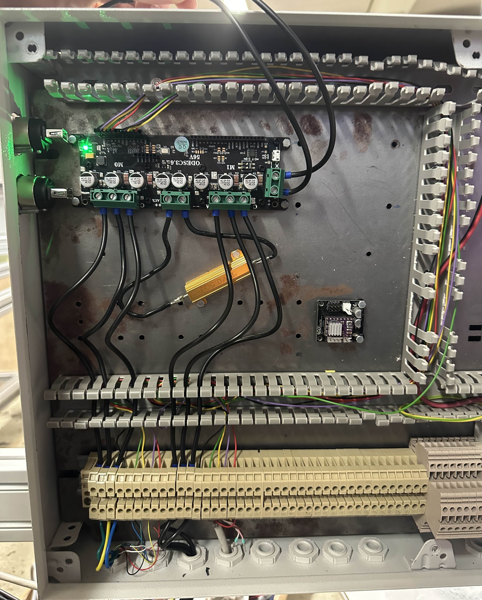
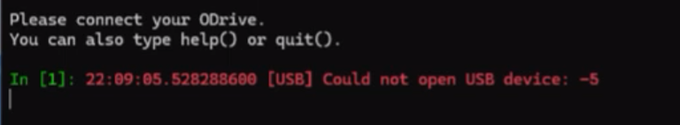
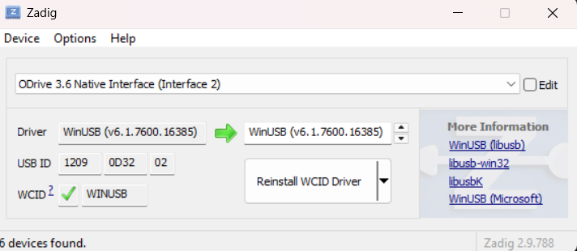

## How to set up the motors:

Hey future Fontys MINOR pixel farming group. Here is a guide on how to setup the motors so that they are able to move.

### Wiring
---

Here is an image of how to wire the ODESC 3.6 motor controller:
 
 
 
 
 
 **Note:** The power resister is Polarity-insensitive and the Quinder 8” 48V DC Brushless HUB motor already has encoders built in. 
  
 
Here you can see an image of how the motors are connected (please excuse the wire colours):

### Configuration:
---

The ODESC might already be configured. If not, then please connect your pc to it with a micro usb-cable.

To configure the ODESC you need the odrivetool. It can be downloaded via python in your terminal with:
 
 
 `pip install odrive`
 
 
Once installed you can just write `odrivetool` in your command line. However after connecting the ODESC via usb you are likely to get this error:
 

 
**Note:** this error is normal for first time connecting
 
 
If that happens you can fix that by reinstalling your drivers with [Zadig](https://zadig.akeo.ie/). 
 
**IMPORTANT:** Check that you have the correct device listed before changing the driver. It should look something like this:

 
Once you are successfully connected we strongly advise you to use our [config file](/workingSetupBothWheels.json). You can load it onto the ODESC by using the following command: 
 
`odrivetool restore-config configName.json`
 
**Note:** To run this command you have to be outside of the odrivetool.

When you run the command it might tell you that not all of the configs were able to be used. However this is fine. Now before running the motors you have to calibrate them.

### Calibrating the Motors
---

**Note:** When calibrating the motors they should be spinning freely in the air!

To do that, open odrivetool and first write this command for the first motor:

`odrv0.axis0.requested_state = AXIS_STATE_FULL_CALIBRATION_SEQUENCE`

Wait for it to finish and then put these commands:

`odrv0.axis0.encoder.config.pre_calibrated = True`
 
`odrv0.axis0.motor.config.pre_calibrated = True`

Now do the same for the other motor:

`odrv0.axis1.requested_state = AXIS_STATE_FULL_CALIBRATION_SEQUENCE`
 
Wait for it to finish. The motor will beep, then the wheel will spin a bit forward and then back 
 
`odrv0.axis1.encoder.config.pre_calibrated = True`
 
`odrv0.axis1.motor.config.pre_calibrated = True`

Now save and reboot:
 
`odrv0.save_configuration()`
 
`odrv0.reboot()`

**IMPORTANT!** Before running either motor you have to put them in the closed loop state with these commands:

`odrv0.axis0.requested_state = AXIS_STATE_CLOSED_LOOP_CONTROL`
 
`odrv0.axis1.requested_state = AXIS_STATE_CLOSED_LOOP_CONTROL`

After that you can set the velocity and the motors shall spin:

`odrv0.axis0.controller.input_vel = 1.0`
 
and
 
`odrv0.axis1.controller.input_vel = 1.0`

A velocity of 1 is already pretty fast.
Now after you calibrated once the next time you want to run the motors you just have to go into the closed loop state and then directly set the velocity.
